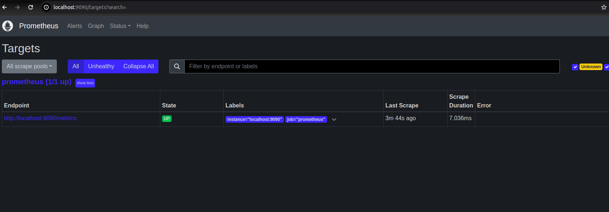
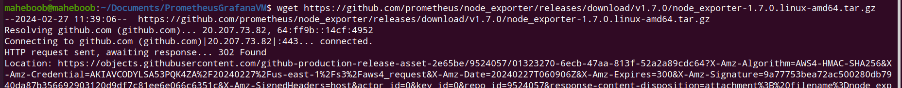

# VM Monitoring via Prometheus(DB & Logger) and Grafana(visualization)


## Table of Contents

- [About](#about)
- [Getting Started](#getting_started)
- [Usage](#usage)
- [Contributing](../CONTRIBUTING.md)

## About <a name = "about"></a>

Write about 1-2 paragraphs describing the purpose of your project.

## Getting Started <a name = "getting_started"></a>

These instructions will get you a copy of the project up and running on your local machine for development and testing purposes. See [deployment](#deployment) for notes on how to deploy the project on a live system.

### Prerequisites

What things you need to install the software and how to install them.

```
Give examples
```

### Installing

A step by step series of examples that tell you how to get a development env running.

Say what the step will be

```
Give the example
```

Check the URL 

http://localhost:9090/targets?search=




## NodePorter <a name = "NodePorter"></a>


Firstly create a system user for Nodeporte
```
sudo useradd \
    --system \
    --no-create-home \
    --shell /bin/false node_exporter

```

Download the latest version from
https://prometheus.io/download/

```
wget https://github.com/prometheus/node_exporter/releases/download/v1.7.0/node_exporter-1.7.0.linux-amd64.tar.gz

```




Extract node exporter from the archive.
```
tar -xvf node_exporter-1.7.0.linux-amd64.tar.gz
```

Move the binary 

```
sudo mv \
  node_exporter-1.7.0.linux-amd64/node_exporter \
  /usr/local/bin/

```

Cleanup the zip and folder 

```
rm -rf node_exporter*
```